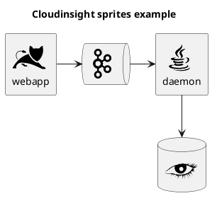
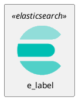
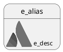
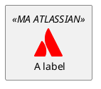
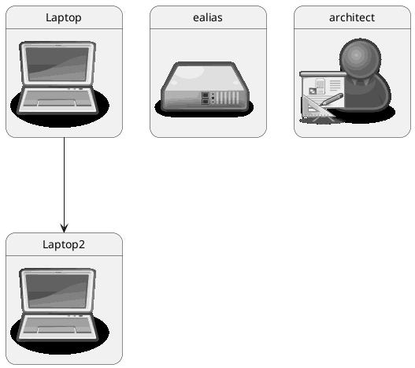
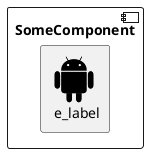

# PlantUML stdlib snippets for vscode

This extension provides you number of the dummy code snippets for PlantUML standard library https://plantuml.com/stdlib

Supported stdlib extensions

| StdLib name  |  Required common macros  |  Folder include macros supported  |  Snippets include prefix  |   |   |
|---|---|---|---|---|---|
| aws  | i-aws-common  | N/A  | ia  |   |   |
| awslib  | N/A  | i-all  | i-  |   |   |
| azure  | i-azure-common  | i-all-  | i-  |   |   |
| cloudinsight  | N/A  |   | i-cloudinsight  |   |   |
| cloudogu  | i-co-common  |   |  i-co  |   |   |
| elastic  | i-elastic-common  |   | i-es  |   |   |
| logo  | N/A  |   | i-logo  |   |   |
| material  | i-material-common  |   | i-material  |   |   |
| office  | i-off-common  |   |  i-off |   |   |
| osa  | N/A  |   |  i-osa |   |   |
| tupadr3  | i-t3-common  |   | i-t3  |   |   |

Idea for the snippets is to speedup time needed to recall how is called your favorite icon from stdlib and use it in your plantuml diagram.
Depending on a stdlib library used you might need to invoke following steps:

a) Invoke required "include-common" macros which initializes diagram for subsequent library objects.

Usually you are starting to type `i-` (which is shortened for `include-`) followed by library and word common. Note that VSCode is smart enough
to do a fuzzy search, thus you could just time smth like `iawscommon` in one word

b) Include icons that will be used in your diagram

On that moment you should briefly recall what kind of object you want to draw in your diagram.
Thus you could look for either part of the object name  `i-aws-efsfilesystem_large`, group and object name `i-aws-Storage-efsfilesystem`.

c) Now you can insert object itself

usual text to be used in fuzzy search would be library code - object name  `aws-amazonefs`.  As usually vscode smart enough, thus you can use quite fuzzy combination of words.

## Notes on a specific libraries

### aws

As seen on a screen recording below, usually you are supposed to have some prototype of the future diagram in raw plant uml, and use stdlib/aws to provide greater visualization
to the diagram. On a moment when you want to include some icon, you start snippet search with `ia` followed by icon topic or name. On a moment, when you want to use icon itself,
you just start typing approximate icon name. The one in appercase will be the needed one

## awslib

That extension is kind of official "icons" released under https://github.com/awslabs/aws-icons-for-plantuml ; It appeared later than `aws` and the most notible difference
from classic `aws` lib is presence of the cumulative include all files with sprites divided in a limited set of areas. You could also distinguish icons from that set
by selecting AWS entity in a CamelCase.

|Section                             |snippet shortcut                   |
|--|--|
| Analytics/                         | iall-analytics                    |
| AWSCostManagement/                 | iall-awscostmanagement            |
| Compute/                           | iall-compute                      |
| Database/                          | iall-database                     |
| GameTech/                          | iall-gametech                     |
| InternetOfThings/                  | iall-internetofthings             |
| MediaServices/                     | iall-mediaservices                |
| NetworkingAndContentDelivery/      | iall-networkingandcontentdelivery |
| Satellite/                         | iall-satellite                    |
| ApplicationIntegration/            | iall-applicationintegration       |
| Blockchain/                        | iall-blockchain                   |
| CustomerEnablement/                | iall-customerenablement           |
| DeveloperTools/                    | iall-developertools               |
| General/                           | iall-general                      |
| MachineLearning/                   | iall-machinelearning              |
| MigrationAndTransfer/              | iall-migrationandtransfer         |
| QuantumTechnologies/               | iall-quantumtechnologies          |
| SecurityIdentityAndCompliance/     | iall-securityidentityandcompliance|
| ARVR/                              | iall-arvr                         |
| BusinessApplications/              | iall-businessapplications         |
| CustomerEngagement/                | iall-customerengagement           |
| EndUserComputing/                  | iall-endusercomputing             |
| GroupIcons/                        | iall-groupicons                   |
| ManagementAndGovernance/           | iall-managementandgovernance      |
| Mobile/                            | iall-mobile                       |
| Robotics/                          | iall-robotics                     |
| Storage/                           | iall-storage                      |

For a simplicity, we introduce few additional "meta" snippets, which are `ial-all` - include all of the
categories and  `ial-all-mostused` - opinionated "most used" by myself

Diagrams constructed with this extension look like "Azure" ones

## azure

That extension is kind of official "icons" released under https://github.com/RicardoNiepel/Azure-PlantUML;
Also supports categoru includes, thus "meta" snippets, which are  `i-azure-all` - include all of the
categories and  `i-azure-mostused` - opinionated "most used" by myself are also included.
The most easiest way to start typing Azure entity name and select corresponding one

## c4

NOT included, because it has own supported snippets for visual studio code

## cloudinsight

Usually used as a sprites to provide better appearence for classic rectangles. You generally could search for the snippet via `i-cloudinsight-topic` , of topic is found you can use it in your diagram. Number of sprites around 50, but you might be lucky.

Can be used with deployment diagram terms https://plantuml.com/deployment-diagram , if you are looking for standalone object, proceed with logos

## clouddogu

https://github.com/cloudogu/plantuml-cloudogu-sprites

Around 50 sprites, mostly related to devops. You should generally could look for term with `i-co-term` and then insert term in uppercase.

```plantuml

@startuml
!include <cloudogu/common>
!include <cloudogu/dogus/redmine>
!include <cloudogu/tools/ansible>

DOGU_REDMINE(e_alias, "e_label")
TOOL_ANSIBLE(zz, "e_label")
@enduml


```

## elastic

https://github.com/Crashedmind/PlantUML-Elastic-icons

Tons of entities related to elasticsearch architecture, group level includes are not supported. Thus you first reference entity
by searching `i-es-entityname` and using entity in diagram. Object snippets are uppercased.

## kubernetes

NOT included but planned (harder to parse composition of sprites)

## logos

Number of different logos from the real world. You first reference logo by searching `i-logo-term`. If term is found, you can use it

Unfortunately, can be used in deployment diagram

## material

Around hundred of different icons similar to logs, but in google material theme. Can be combined with deployment diagram.
You need a bootstraper, i.e. include common library and reference separately all used icons. (Find them with i-material)

In order to insert object, all snippets start with MA_, uppercased, so quite easy to find macros.

## office

https://github.com/Roemer/plantuml-office

Set of icons which might help you to better visualize, for example, deployment diagram. Quite large number of terms.
First you could try to look for object with `i-off-term`. If found, you can use entity by looking for a snippet starting with OFF_ and uppercase.
Just a gentle reminder, vscode supports fuzzy search.

Shares common library for different project, thus needs to be included first (!include <tupadr3/common> - macros `i-off-common`)

Objects can be combined with deployment diagram (rectangle, database and so on)

```plantuml

@startuml
!include <tupadr3/common>
!include <office/Concepts/bandwidth_calculator>

OFF_BANDWIDTH_CALCULATOR(e_alias, "e_label")

@enduml


```

## osa

https://github.com/Crashedmind/PlantUML-opensecurityarchitecture-icons

The nice set of icons for DevSecOps, but unfortunately I failed to find any compatible diagram, so OSA diagram can use only OSA sprites

## tupadr3

https://github.com/tupadr3/plantuml-icon-font-sprites

The following icon sets are included:

| Name                                                       | Index                                     |
| ---------------------------------------------------------- | ----------------------------------------- |
| [Font-Awesome 4](https://fontawesome.com/v4.7.0/)          | [List of macros](https://github.com/tupadr3/plantuml-icon-font-sprites/blob/master/font-awesome/index.md)   |
| [Font-Awesome 5](http://fontawesome.io/)                   | [List of macros](https://github.com/tupadr3/plantuml-icon-font-sprites/blob/master/font-awesome-5/index.md) |
| [Devicons](http://vorillaz.github.io/devicons)             | [List of macros](https://github.com/tupadr3/plantuml-icon-font-sprites/blob/master/devicons/index.md)       |
| [Govicons](http://govicons.io/)                            | [List of macros](https://github.com/tupadr3/plantuml-icon-font-sprites/blob/master/govicons/index.md)       |
| [Weather](https://erikflowers.github.io/weather-icons/)    | [List of macros](https://github.com/tupadr3/plantuml-icon-font-sprites/blob/master/weather/index.md)        |
| [Material](http://google.github.io/material-design-icons/) | [List of macros](https://github.com/tupadr3/plantuml-icon-font-sprites/blob/master/material/index.md)       |
| [Devicon 2](https://konpa.github.io/devicon/)              | [List of macros](https://github.com/tupadr3/plantuml-icon-font-sprites/blob/master/dev2/index.md)           |

Requires common file to be included, you can use snippet `i-t3-common` , every icon has a prefix related to one of the sets above,
i.e. `FA_`, `FA5_`, `DEV_`, `GOV_`, `WEATHER_`, `MATERIAL_`

I am usually searching for a icon to include with `i-t3-term`, if found I then reference the icon by searching the uppercased term.
The icon, which starts with one of the prefixes above most likely is the one you looking for.

All the icons can be used with deployment diagrams.

